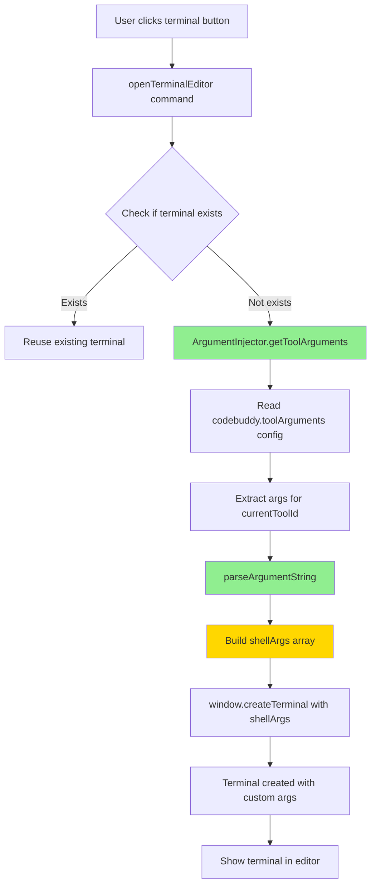

# Codebuddy Terminal Editor - Custom CLI Arguments Enhancement Architecture

## Introduction

本文档定义了为 Codebuddy Terminal Editor VS Code 扩展（v0.1.6）添加**自定义 CLI 参数配置**功能的架构方案。此增强允许用户通过 VS Code 设置为每个 AI 工具配置命令行参数，无需修改代码。

### Relationship to Existing Architecture

本文档补充现有的 `docs/brownfield-architecture.md`，专注于新功能的集成策略。所有新组件将无缝集成到现有的终端生命周期管理和工具切换机制中。

### Change Log

| Change | Date | Version | Description | Author |
|--------|------|---------|-------------|--------|
| 初始创建 | 2025-10-30 | 1.0 | 自定义 CLI 参数功能架构设计 | Winston (Architect) |

---

## Enhancement Scope and Integration Strategy

### Enhancement Overview

**Enhancement Type**: 功能添加（Feature Addition）  
**Scope**: 配置系统扩展 + 终端创建逻辑增强  
**Integration Impact**: 🟡 中等（修改核心终端创建流程，但保持向后兼容）

### Current Project State

- **Primary Purpose**: VS Code 扩展，提供对 6 个 AI CLI 工具的集成终端访问
- **Current Tech Stack**: TypeScript 5.9.3 (strict)、VS Code API ^1.99.0、Node.js (内嵌)
- **Architecture Style**: 单文件架构（`extension.ts` 550行）+ 工具模块（`terminal-utils.ts` 125行）
- **Deployment Method**: `.vsix` 包，通过 `@vscode/vsce` 打包

### Available Documentation

- `docs/brownfield-architecture.md` - 当前系统完整技术文档（v1.1）
- `docs/prd.md` - 自定义参数功能需求文档（v0.2.0）
- `README.md` / `README_EN.md` - 用户文档
- `CODEBUDDY.md` - 开发者指南
- `docs/TESTING.md` - 测试策略文档

### Identified Constraints

- **单文件架构限制** - 必须在 `extension.ts` 中保持代码简洁
- **TypeScript 严格模式** - 所有新代码必须通过严格类型检查
- **VS Code API 限制** - 不能使用外部终端管理库
- **向后兼容性要求** - 现有用户工作流不能被破坏
- **无外部依赖** - 运行时不能引入新的 npm 依赖

### Integration Approach

**代码集成策略**: 最小化修改，集中在两个文件
- `package.json` - 添加配置模式声明
- `src/extension.ts` - 在 `openTerminalEditor` 命令中插入参数注入逻辑

**数据库集成**: 不适用（无数据库）

**API 集成**: 不适用（无外部 API 调用）

**UI 集成**: 
- 利用 VS Code 内置的设置 UI（`contributes.configuration`）
- 无需自定义 UI 组件

### Compatibility Requirements

- **Existing API Compatibility**: 所有现有命令和配置保持功能
- **Database Schema Compatibility**: 不适用
- **UI/UX Consistency**: 遵循 VS Code 设置 UI 规范
- **Performance Impact**: 配置读取 < 50ms，不影响终端创建速度

### Integration Validation Checkpoint

**基于我的分析，集成策略考虑了以下现有系统特征**：

1. **配置系统已验证** - `codebuddy.terminalCommand` 等配置成功使用 `contributes.configuration` 模式
2. **终端创建入口单一** - `openTerminalEditor`（line 331）是唯一创建点，易于注入参数
3. **工具描述符系统** - `AI_TOOLS` 数组和 `currentToolId` 提供工具 ID 到配置的映射
4. **Shell 参数传递机制** - `createTerminal()` 的 `shellArgs` 选项已用于传递参数

**此集成方案尊重现有架构模式并最小化风险。**

---

## Tech Stack

### Existing Technology Stack

| Category | Current Technology | Version | Usage in Enhancement | Notes |
|----------|-------------------|---------|----------------------|-------|
| 运行时 | VS Code Extension Host | ^1.99.0 | 执行所有扩展代码 | 无需更改 |
| 语言 | TypeScript | 5.9.3 | 所有新代码使用 TS strict 模式 | 保持严格模式 |
| 编译器 | tsc | 5.9.3 | 编译 TS 到 ES2020 | 无需更改 |
| 测试框架 | Mocha | 11.7.4 | 为参数解析添加单元测试 | 可选扩展 |
| 测试运行器 | @vscode/test-electron | 2.5.2 | 运行集成测试 | 无需更改 |
| 打包工具 | @vscode/vsce | - | 打包 v0.2.0 版本 | 无需更改 |
| 配置 API | VS Code Configuration API | ^1.99.0 | 读取 `codebuddy.toolArguments` | 核心使用 |

### New Technology Additions

**无新技术需要引入** - 所有功能使用现有技术栈实现。

---

## Data Models and Schema Changes

### New Data Models

#### Model: ToolArgumentsConfiguration

**Purpose**: 存储每个 AI 工具的自定义命令行参数

**Integration**: 通过 VS Code 配置系统持久化，在终端创建时读取

**Key Attributes**:
- `codebuddy`: string - Codebuddy CLI 参数（如 `--dangerously-skip-permissions`）
- `gemini`: string - Gemini CLI 参数（如 `--yolo`）
- `claude`: string - Claude Code 参数（如 `--dangerously-skip-permissions`）
- `codex`: string - Codex 参数（如 `--full-auto`）
- `copilot`: string - GitHub Copilot CLI 参数（如 `--allow-all-tools`）
- `cursor-agent`: string - Cursor Agent 参数（如 `--force` 或 `-f`）

**Relationships**:
- **With Existing**: 与 `AI_TOOLS` 数组的 `id` 字段映射
- **With New**: 由新的参数解析逻辑消费

**TypeScript Type Definition**:
```typescript
interface ToolArgumentsConfig {
  codebuddy?: string;
  gemini?: string;
  claude?: string;
  codex?: string;
  copilot?: string;
  'cursor-agent'?: string;
}
```

### Schema Integration Strategy

**Database Changes Required**: 不适用（无数据库）

**Configuration Schema Changes**:
- **New Configuration Keys**: `codebuddy.toolArguments`（object 类型）
- **Modified Configuration Keys**: 无
- **New Validation Rules**: 参数字符串长度 <= 1000 字符
- **Migration Strategy**: 自动（VS Code 处理默认值）

**Backward Compatibility**:
- 未配置 `toolArguments` 时，工具使用空参数启动（当前行为）
- 现有配置项（`terminalCommand`、`terminalName`、`bracketedPasteHack`）保持功能
- 旧版本扩展忽略新配置（VS Code 行为）

---

## Component Architecture

### New Components

#### Component: ArgumentInjector

**Responsibility**: 读取工具参数配置并注入到终端命令中

**Integration Points**: 
- 集成到 `openTerminalEditor` 命令（`src/extension.ts:331`）
- 在 `createTerminal()` 调用之前执行

**Key Interfaces**:
- `getToolArguments(toolId: string): string[]` - 根据工具 ID 获取解析后的参数数组
- `parseArgumentString(argString: string): string[]` - 将参数字符串解析为数组

**Dependencies**:
- **Existing Components**: 
  - `workspace.getConfiguration()` - 读取配置
  - `currentToolId` - 确定当前工具
  - `createTerminal()` - 接收注入的参数
- **New Components**: 无（独立组件）

**Technology Stack**: TypeScript 5.9.3、VS Code API、Node.js 内置 API

**Implementation Details**:
```typescript
// 伪代码示例
function getToolArguments(toolId: string): string[] {
  const config = vscode.workspace.getConfiguration('codebuddy');
  const toolArgs = config.get<ToolArgumentsConfig>('toolArguments', {});
  const argString = toolArgs[toolId] || '';
  
  if (!argString.trim()) {
    return [];
  }
  
  return parseArgumentString(argString);
}

function parseArgumentString(argString: string): string[] {
  // 简单实现：按空格分割，支持引号
  // 可使用正则或 shell-quote 类似的逻辑
  const regex = /[^\s"]+|"([^"]*)"/gi;
  const args: string[] = [];
  let match;
  
  while ((match = regex.exec(argString)) !== null) {
    args.push(match[1] ? match[1] : match[0]);
  }
  
  return args;
}
```

### Component Interaction Diagram



**集成验证**：
新组件遵循现有的**函数式设计模式**（`extension.ts` 中的工具函数），而非面向对象设计。这与当前代码库风格一致。

---

## API Design and Integration

### API Integration Strategy

**API Integration Strategy**: 不适用（无外部 API）  
**Authentication**: 不适用  
**Versioning**: 不适用

**Internal API Changes**:
- `openTerminalEditor` 命令逻辑扩展，添加参数注入步骤
- 新增内部工具函数 `getToolArguments()` 和 `parseArgumentString()`

---

## External API Integration

**无外部 API 集成需求。**

---

## Source Tree

### Existing Project Structure

```
clihub/
├── src/
│   ├── extension.ts              # 550行 - 主扩展逻辑
│   ├── terminal-utils.ts         # 125行 - 终端工具函数
│   └── test/                     # 测试套件
├── docs/
│   ├── brownfield-architecture.md
│   ├── prd.md
│   └── TESTING.md
├── package.json                  # 扩展清单
├── tsconfig.json
├── README.md
└── CODEBUDDY.md
```

### New File Organization

```
clihub/
├── src/
│   ├── extension.ts              # 修改 - 添加参数注入逻辑（约 +50 行）
│   ├── terminal-utils.ts         # 无变更
│   └── test/
│       └── suite/
│           └── argument-injection.test.ts  # 新增 - 参数解析单元测试（可选）
├── docs/
│   ├── brownfield-architecture.md         # 无变更
│   ├── prd.md                              # 无变更
│   └── architecture.md                     # 新增 - 本文档
├── package.json                  # 修改 - 添加 toolArguments 配置模式
├── README.md                     # 修改 - 添加自定义参数文档
├── README_EN.md                  # 修改 - 英文版自定义参数文档
└── CHANGELOG.md                  # 修改 - 记录 v0.2.0 变更
```

### Integration Guidelines

- **File Naming**: 保持现有命名约定（kebab-case）
- **Folder Organization**: 所有核心逻辑保留在 `src/extension.ts`
- **Import/Export Patterns**: 使用 ES6 模块语法，与现有代码一致

---

## Infrastructure and Deployment Integration

### Existing Infrastructure

**Current Deployment**: 手动打包为 `.vsix` 文件，通过私有渠道或本地安装分发  
**Infrastructure Tools**: `@vscode/vsce`（VS Code Extension Manager）  
**Environments**: 无分离环境（用户本地安装）

### Enhancement Deployment Strategy

**Deployment Approach**: 
1. 增量版本号：0.1.6 → 0.2.0（次版本，新功能）
2. 编译 TypeScript：`npm run compile`
3. 打包扩展：`vsce package`
4. 分发 `codebuddy-terminal-editor-0.2.0.vsix`

**Infrastructure Changes**: 无需更改  
**Pipeline Integration**: 无 CI/CD 管道（手动流程）

### Rollback Strategy

**Rollback Method**: 用户可卸载 v0.2.0 并重新安装 v0.1.6 的 `.vsix` 文件  
**Risk Mitigation**: 
- 保留 v0.1.6 的 `.vsix` 文件作为备份
- 新功能默认禁用（空配置 = 当前行为）
- 无破坏性数据迁移

**Monitoring**: 无自动化监控，依赖用户反馈和手动日志检查

---

## Coding Standards

### Existing Standards Compliance

**Code Style**: 
- 2 空格缩进
- 使用分号
- camelCase 变量和函数名
- UPPER_SNAKE_CASE 常量名

**Linting Rules**: 
- TypeScript 严格模式启用
- 所有类型必须显式声明或可推断
- 无隐式 `any` 类型

**Testing Patterns**: 
- Mocha + BDD 风格（`describe`、`it`）
- 测试文件位于 `src/test/suite/`
- 集成测试使用真实 VS Code Extension Host

**Documentation Style**: 
- 关键函数使用 JSDoc 注释
- 复杂逻辑添加内联注释
- README 使用 Markdown 格式

### Enhancement-Specific Standards

- **参数解析安全性**: 使用正则表达式或经过验证的解析逻辑，避免命令注入
- **错误处理模式**: 参数解析失败时记录警告，回退到空参数数组
- **配置验证**: 在使用前验证参数字符串长度和格式
- **日志记录**: 使用现有的 `log.info()` / `log.debug()` / `log.error()` 模式

### Critical Integration Rules

- **Existing API Compatibility**: `openTerminalEditor` 命令签名保持不变
- **Database Integration**: 不适用
- **Error Handling**: 参数注入失败不阻止终端创建，记录错误并继续
- **Logging Consistency**: 使用 `[Codebuddy]` 前缀，与现有日志格式一致

**示例日志**:
```typescript
log.info(`[Codebuddy] Injecting custom arguments for ${toolId}: ${args.join(' ')}`);
log.debug(`[Codebuddy] Parsed ${args.length} arguments from config`);
log.error(`[Codebuddy] Failed to parse arguments: ${error.message}`);
```

---

## Testing Strategy

### Integration with Existing Tests

**Existing Test Framework**: Mocha 11.7.4 + @vscode/test-electron 2.5.2  
**Test Organization**: `src/test/suite/` 目录，按功能模块分文件  
**Coverage Requirements**: 无正式覆盖率要求，但核心逻辑应有测试

### New Testing Requirements

#### Unit Tests for New Components

**Framework**: Mocha  
**Location**: `src/test/suite/argument-injection.test.ts`（可选创建）  
**Coverage Target**: 
- `parseArgumentString()` - 100%（各种输入格式）
- `getToolArguments()` - 主要场景覆盖

**Integration with Existing**: 
- 使用相同的测试运行器和辅助函数（`src/test/suite/test-helpers.ts`）
- 遵循现有测试文件的结构和命名约定

**测试用例示例**:
```typescript
describe('parseArgumentString', () => {
  it('should parse simple arguments', () => {
    const result = parseArgumentString('--flag value');
    assert.deepStrictEqual(result, ['--flag', 'value']);
  });
  
  it('should handle quoted arguments', () => {
    const result = parseArgumentString('--message "hello world"');
    assert.deepStrictEqual(result, ['--message', 'hello world']);
  });
  
  it('should return empty array for empty string', () => {
    const result = parseArgumentString('');
    assert.deepStrictEqual(result, []);
  });
});
```

#### Integration Tests

**Scope**: 
- 验证未配置参数时工具正常启动（回归测试）
- 验证配置参数后工具接收正确参数
- 验证工具切换后参数独立生效

**Existing System Verification**: 
- 所有 6 个 AI 工具在默认配置下启动测试
- 终端复用机制不受影响测试
- 工具切换功能不受影响测试

**New Feature Testing**: 
- 为每个工具配置参数并验证终端命令
- 测试多个参数的解析和注入
- 测试参数配置的实时生效（重新打开终端）

#### Regression Testing

**Existing Feature Verification**: 
- 手动运行所有现有命令（`openTerminalEditor`、`sendPathToTerminal`、`switchAITool`）
- 验证快捷键 `Cmd+Shift+J` 仍正常工作
- 验证状态栏和编辑器按钮功能

**Automated Regression Suite**: 
- 现有的 41 个测试用例（36 单元 + 5 集成）必须全部通过
- 新增测试不应破坏现有测试

**Manual Testing Requirements**: 
- 在 Extension Development Host 中测试完整用户工作流
- 测试不同平台（macOS、Windows、Linux）- 如可行

---

## Security Integration

### Existing Security Measures

**Authentication**: 不适用（本地扩展，无用户认证）  
**Authorization**: 不适用  
**Data Protection**: 
- 用户配置存储在 VS Code 设置文件（`settings.json`）
- 不收集或传输任何用户数据

**Security Tools**: 无特定安全工具

### Enhancement Security Requirements

**New Security Measures**: 
- **命令注入防护**: 参数解析逻辑必须防止 shell 命令注入
- **输入验证**: 限制参数字符串长度（<= 1000 字符）
- **安全日志**: 不记录可能包含敏感信息的参数值（如 API keys）

**Integration Points**: 
- 参数字符串在传递给 `createTerminal()` 前进行清理
- 使用 VS Code API 的安全机制（`shellArgs` 数组而非字符串拼接）

**Compliance Requirements**: 无特定合规要求

### Security Testing

**Existing Security Tests**: 无正式安全测试  
**New Security Test Requirements**: 
- 测试恶意输入（如 `; rm -rf /`、`&& cat /etc/passwd`）是否被正确隔离
- 验证参数作为独立参数传递，而非执行命令

**Penetration Testing**: 不适用（内部工具）

**安全最佳实践**:
1. **使用数组而非字符串拼接**: 
   ```typescript
   // ✅ 安全
   shellArgs: ['--flag', userInput]
   
   // ❌ 不安全
   shellArgs: `--flag ${userInput}`.split(' ')
   ```

2. **参数验证**:
   ```typescript
   if (argString.length > 1000) {
     log.error('[Codebuddy] Argument string too long, ignoring');
     return [];
   }
   ```

3. **日志脱敏**:
   ```typescript
   log.info(`[Codebuddy] Custom arguments configured for ${toolId}`);
   // 不记录 args 的具体内容，防止泄露敏感信息
   ```

---

## Checklist Results Report

### Brownfield Architecture Validation Checklist

**执行日期**: 2025-10-30  
**执行者**: Winston (Architect)

#### 1. 现有系统理解

- ✅ 已审查 `docs/brownfield-architecture.md`（v1.1）
- ✅ 已审查 `docs/prd.md`（v0.2.0）
- ✅ 已分析 `src/extension.ts` 核心逻辑
- ✅ 已分析 `package.json` 配置模式
- ✅ 已理解终端生命周期管理机制

#### 2. 集成点验证

- ✅ 终端创建入口点已确认（`openTerminalEditor` line 331）
- ✅ 配置读取机制已验证（`workspace.getConfiguration()` 已使用）
- ✅ 参数传递机制已确认（`shellArgs` 数组）
- ✅ 工具 ID 映射机制已理解（`AI_TOOLS` 数组 + `currentToolId`）

#### 3. 向后兼容性

- ✅ 未配置参数时回退到当前行为（空 `shellArgs`）
- ✅ 现有命令签名保持不变
- ✅ 现有配置项不受影响
- ✅ 无破坏性数据迁移

#### 4. 技术约束

- ✅ 保持单文件架构（仅修改 `extension.ts`）
- ✅ 遵循 TypeScript 严格模式
- ✅ 无新外部依赖
- ✅ 使用 VS Code 标准 API

#### 5. 安全性

- ✅ 使用数组传递参数（防止命令注入）
- ✅ 参数长度验证（<= 1000 字符）
- ✅ 错误处理不阻止终端创建
- ✅ 日志脱敏（不记录参数详情）

#### 6. 测试覆盖

- ✅ 计划单元测试（参数解析）
- ✅ 计划集成测试（终端创建验证）
- ✅ 回归测试策略（现有 41 测试必须通过）
- ✅ 手动测试清单（6 个工具 × 有/无参数）

#### 7. 文档完整性

- ✅ 本架构文档涵盖所有集成点
- ✅ 计划更新 README（配置示例 + YOLO 模式说明）
- ✅ 计划更新 CHANGELOG（v0.2.0 发布说明）
- ✅ 保留现有文档结构

**总体评估**: ✅ **通过** - 架构方案满足所有棕地集成要求

---

## Next Steps

### Story Manager Handoff

**给 Story Manager 的提示**：

```
请基于以下信息开始实施自定义 CLI 参数功能：

参考文档：
- docs/architecture.md（本架构文档）
- docs/prd.md（v0.2.0 需求文档）
- docs/brownfield-architecture.md（现有系统状态）

关键集成要求（已与用户验证）：
- 配置系统：使用 VS Code 的 contributes.configuration 模式（已验证可行）
- 终端创建入口：修改 openTerminalEditor 命令（src/extension.ts:331）
- 参数传递：使用 shellArgs 数组（安全且已在代码中使用）
- 向后兼容：未配置参数时行为与 v0.1.6 完全相同

现有系统约束（基于实际项目分析）：
- 单文件架构 - 保持 extension.ts 简洁（当前 550 行，预计增加约 50 行）
- TypeScript 严格模式 - 所有新代码必须通过类型检查
- 无外部依赖 - 仅使用 VS Code API 和 Node.js 内置模块
- 6 个工具支持 - 所有参数配置必须独立生效

首个 Story 实施建议：
Story 1.1 - Configuration Schema and UI
- 在 package.json 中添加 codebuddy.toolArguments 配置模式
- 验证 VS Code 设置 UI 正确渲染
- 确认配置持久化工作正常
- 回归测试：所有 6 个工具在未配置参数时正常启动

清晰的集成检查点：
1. 配置模式声明后，在 VS Code 设置中搜索 "tool arguments" 验证可见性
2. 修改配置后，通过 workspace.getConfiguration() 验证读取正确
3. 参数注入后，在终端中执行 `echo $0 $@` 验证参数传递
4. 每个开发步骤后运行现有 41 个测试，确保无回归

强调：在整个实施过程中保持现有系统完整性 - 新功能应为增强而非重构。
```

### Developer Handoff

**给开发者的提示**：

```
开始实施自定义 CLI 参数功能 - v0.2.0

参考文档：
- docs/architecture.md（技术架构）
- docs/brownfield-architecture.md（现有系统分析）
- docs/prd.md（功能需求）
- src/extension.ts（核心逻辑 - 当前版本 0.1.6）

现有 Coding Standards（基于实际项目分析）：
- 代码风格：2 空格缩进、使用分号、camelCase 命名
- 类型系统：TypeScript 5.9.3 strict 模式
- 日志格式：`log.info('[Codebuddy] message')`
- 错误处理：`try { ... } catch (e) { log.error(...); }`

关键技术决策（基于真实项目约束）：
1. **配置读取**：使用现有模式 `workspace.getConfiguration('codebuddy').get<T>('toolArguments')`
2. **参数解析**：实现 `parseArgumentString(str: string): string[]`，支持引号和空格
3. **参数注入**：在 openTerminalEditor 中，createTerminal 调用前插入逻辑
4. **错误回退**：解析失败时返回空数组 `[]`，不阻止终端创建

现有系统兼容性要求（具体验证步骤）：
1. **配置读取兼容** - 使用 `get<ToolArgumentsConfig>('toolArguments', {})` 提供默认值
2. **终端创建兼容** - 仅修改 shellArgs，不改变其他 createTerminal 选项
3. **工具切换兼容** - 参数读取使用 currentToolId，自动支持切换
4. **测试兼容** - 运行 `npm test` 确保所有 41 个测试通过

实施顺序（最小化风险）：
第 1 步：修改 package.json（约 30 行配置模式声明）
第 2 步：实现参数解析函数（约 30 行）
第 3 步：集成到 openTerminalEditor（约 10 行）
第 4 步：添加日志和错误处理（约 10 行）
第 5 步：更新 README（配置示例 + YOLO 模式警告）
第 6 步：手动测试所有 6 个工具（有/无参数）

关键代码位置：
- 配置模式：package.json line 40 附近（contributes.configuration 部分）
- 参数注入：src/extension.ts line 331-430（openTerminalEditor 命令）
- 类型定义：src/extension.ts line 30 附近（interface 声明区域）

预期代码增量：约 80 行（50 行逻辑 + 30 行配置模式）

测试清单：
- [ ] 无参数配置时，6 个工具全部正常启动（回归）
- [ ] 配置 Cursor Agent `--force` 后，终端显示该参数
- [ ] 配置多个参数 `--flag1 --flag2 "value with space"` 正确解析
- [ ] 格式错误的参数字符串记录错误但不崩溃
- [ ] 工具切换后，参数独立生效
- [ ] 现有 41 个测试全部通过

开始前请确认：
1. 已阅读 docs/brownfield-architecture.md 理解终端生命周期
2. 已阅读 docs/prd.md 理解 YOLO 模式参数需求
3. 已运行 `npm run compile` 确保开发环境正常
4. 已创建 git 分支 `feature/custom-cli-arguments`

祝开发顺利！如有疑问请参考架构文档或现有代码模式。
```

---

## Document Metadata

**版本**: 1.0  
**状态**: 最终稿（YOLO 模式完成）  
**创建日期**: 2025-10-30  
**作者**: Winston (Architect Agent)  
**审核状态**: 待用户审核  

**文档目的**: 
为开发团队提供清晰的技术实施指南，确保自定义 CLI 参数功能无缝集成到现有 Codebuddy Terminal Editor 系统中，同时保持向后兼容性和代码质量。

**下一步行动**:
1. 用户审核本架构文档
2. 批准后移交给 Story Manager 或 Developer
3. 开始 Story 1.1 实施（Configuration Schema）

---

**架构设计完成！** 🏗️✨

Winston (Architect) 签名
